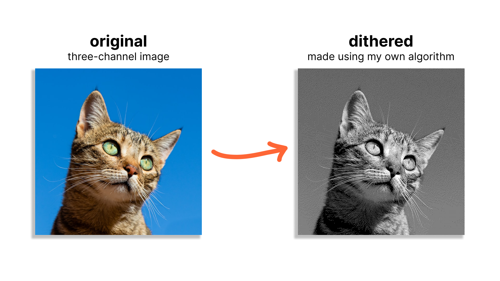

# Aman's Dither

My very own error-diffusion dithering algorithm (implemented in the Racket programming language).

To learn more, read my blog post about this project [here](https://amanvir.com/blog/writing-my-own-dithering-algorithm-in-racket).
